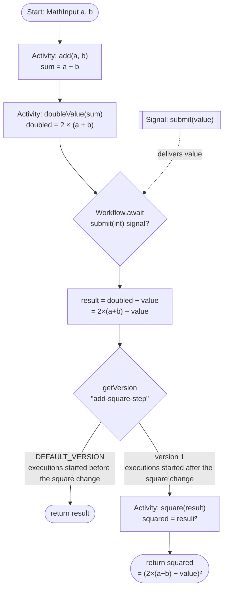

# Temporal Java Foundations

[English](./README.md) · [한국어](./README_ko_kr.md)

A hands-on starter lab for learning **Temporal** with Java. You build **one workflow**,
one small step at a time, across four labs — starting from your very first activity and
ending with a determinism/versioning exercise.

Everything is **debug-ready**: breakpoints, a debug launch config, and a generous
workflow-task timeout so you can sit on a breakpoint without anything timing out.

---

## Two modules: `starter` and `solution`

| Module | What it is |
|--------|-----------|
| **`starter/`** | Your working copy. The scaffolding is in place; you fill in the `// TODO Lab N` bodies. |
| **`solution/`** | The finished, runnable reference. Peek when you're stuck, or run it to see the target behavior. |

Both modules share the same package (`foundations`) and the same file names, so the only
difference is the code *you* write.

---

## What you'll build

By the end, `MathWorkflow` computes:

```
(2 × (a + b) − submittedValue)²
```

For example, `a=3, b=4` and a submitted signal value of `5` gives
`(2×(3+4) − 5)² = (14 − 5)² = 9² = 81`.

The labs come in **two sessions** with a break in between:

**Part 1 — build the pipeline** (Labs 1–3): finish at `2 × (a + b) − submittedValue`.

| Lab | You add | Concept |
|-----|---------|---------|
| **1** | An `add(a, b)` activity + a workflow that calls it | Your first activity & workflow, input structs |
| **2** | A `doubleValue` activity, chained onto the sum | Chaining activities; each is a durable checkpoint |
| **3** | A `submit(int)` **signal**, then subtract it | Signals & `Workflow.await` (parking a workflow) |

**☕ Break.**

**Part 2 — event history & determinism** (Labs 4–5): understand the durable log, then evolve the code safely.

| Lab | You do | Concept |
|-----|--------|---------|
| **4** | Read the event history of what you built | Event history: the durable log; replay |
| **5** | Add a `square` activity, introduced **safely** | Determinism, replay, and `Workflow.getVersion` |

### The finished workflow



> **Part 1** builds everything up to `return result` (`2×(a+b) − value`). **Part 2** adds
> the `getVersion` branch and the `square` activity — safely, without breaking the
> executions you started in Part 1.

---

## Prerequisites

1. **A JDK, version 17 or newer.** Check with `java -version`. On macOS:
   `brew install openjdk@21`.
2. **A running Temporal _debug_ server** — follow [`PREREQUISITES.md`](./PREREQUISITES.md)
   ([한국어](./PREREQUISITES_ko_kr.md)) once to build and start it.

> **Why the debug server, not `temporal server start-dev`?** Lab 5's determinism exercise
> (and holding breakpoints in workflow code) needs a server whose internal timeouts are
> relaxed ×100 so it won't give up on a paused worker. `PREREQUISITES.md` builds exactly
> that, plus **`tdbg`** — the tool the `scripts/history.sh` / `scripts/describe.sh` helpers
> use to decode raw history from the database. Do that setup first.

You do **not** need to install Gradle — the repo ships a *Gradle wrapper* (`./gradlew`)
that downloads the pinned Gradle version on first use. Always use `./gradlew`, never a
system `gradle`.

---

## Repo layout

```
temporal-java-foundations/
├── README.md / README_ko_kr.md          # this guide (EN / KO)
├── PREREQUISITES.md / PREREQUISITES_ko_kr.md   # one-time server setup (EN / KO)
├── build.gradle              # shared config for both modules
├── settings.gradle           # includes :starter and :solution
├── gradlew / gradle/         # Gradle wrapper (no install needed)
├── .vscode/launch.json       # VS Code debug + run configs for both modules
├── .run/                     # IntelliJ IDEA run configs (same six entries)
├── scripts/                  # bash helpers (run-worker, start, signal, history, ...)
├── starter/
│   └── src/main/java/foundations/
│       ├── MathInput / DoubleInput / SquareInput .java   # input structs (given)
│       ├── MathActivities.java        # @ActivityInterface (given)
│       ├── MathActivitiesImpl.java    # ← YOU fill in the bodies
│       ├── MathWorkflow.java          # @WorkflowInterface (given)
│       ├── MathWorkflowImpl.java      # ← YOU build this up across the labs
│       ├── WorkerApp.java             # hosts the code, starts the worker (given)
│       ├── Starter.java               # starts one workflow (given)
│       └── SignalSender.java          # sends the submit(int) signal (given)
└── solution/                 # same files, fully implemented
```

---

## Step 0 — make sure the server is running

Complete [`PREREQUISITES.md`](./PREREQUISITES.md) once. Afterward you should have, running
in their own terminals: the **Docker database stack** (`make start-dependencies`) and the
**debug server** (`./temporal-server-debug ... start`) on `localhost:7233`, with the
**Web UI on http://localhost:8080**. Keep the UI open — it's where you'll watch event
history, signals, and failures.

---

## How to run

You need **two** processes: the **worker** (runs your workflow/activity code) and a
**starter** (kicks off one workflow). Lab 3 adds a third step: sending a **signal**.

### With the helper scripts (simplest)

The `scripts/` helpers default to the **`starter`** module; prefix `MODULE=solution` to use
the reference module instead. See [Helper scripts](#helper-scripts) for the full list.

```bash
# Terminal 1 — the worker (Ctrl-C to stop, restart after code changes):
./scripts/run-worker.sh

# Terminal 2 — start a workflow with a=3, b=4:
./scripts/start.sh 3 4

# Terminal 2 — (Lab 3+) send the submit signal with value=5:
./scripts/signal.sh 5

# ...then check the result:
./scripts/result.sh
```

### With Gradle directly

Replace `<module>` with `starter` or `solution`.

```bash
./gradlew :<module>:run                          # Terminal 1 — worker
./gradlew :<module>:runStarter --args="3 4"      # Terminal 2 — start
./gradlew :<module>:runSignal  --args="5"        # Terminal 2 — signal (Lab 3+)
temporal workflow result --workflow-id math-wf   # result
```

### From the IDE (best for breakpoints)

The repo ships the **same six run configurations** for both editors — `.vscode/launch.json`
for VS Code and `.run/` for IntelliJ IDEA. Whichever you use, the flow is identical:

1. Run **“Worker (debug) — `<module>`”**. It sets `TEMPORAL_DEBUG=true` so breakpoints in
   *workflow* code don't trip the deadlock detector.
2. Run **“Start — `<module>`”** to kick off a workflow.
3. (Lab 3+) Run **“Signal — `<module>`”** to send the signal.

Set breakpoints on the `>>> BREAKPOINT <<<` markers in the code.

**VS Code.** Install the *Extension Pack for Java*, open the repo folder, and pick a
configuration from the **Run and Debug** panel (Ctrl/Cmd-Shift-D). Use the green ▶ for
run, or **Start Debugging** (F5) to stop on breakpoints.

**IntelliJ IDEA** (Community or Ultimate). Open the repo folder — IDEA detects
`settings.gradle` and imports it as a Gradle project; let the import finish so the
`starter` and `solution` modules exist. The six configurations from `.run/` then appear in
the run-configuration dropdown in the toolbar. Use ▶ to run, or the 🐞 **Debug** button to
stop on breakpoints.

> **First-run notes for IDEA.** Set **Project SDK** to a JDK 17+ under *File → Project
> Structure → Project*. If a configuration shows “module not specified”, the Gradle import
> hasn't finished (or used different module names) — re-sync from the **Gradle** tool
> window (🔄) and, if needed, pick `temporal-java-foundations.<module>.main` in the
> configuration's **Module** dropdown. The `./gradlew` tasks (`run`, `runStarter`,
> `runSignal`) are also listed in the **Gradle** tool window if you prefer those.

---

## Part 1 — Build the pipeline (Labs 1–3)

Work in the **`starter`** module. After each lab, **restart the worker** (it holds your
compiled code in memory) and run a workflow to check your result. Part 1 finishes with the
workflow computing `2 × (a + b) − submittedValue` — then you take a break.

### Lab 1 — your first activity and workflow

**Goal:** `add(a, b)` returns `a + b`.

1. In `MathActivitiesImpl.java`, implement `add` to return `in.a + in.b`.
2. In `MathWorkflowImpl.java`, in `run(...)`, call `activities.add(in)` and return it.
3. Restart the worker, then:
   ```bash
   ./scripts/start.sh 3 4
   ```
   For now the workflow returns as soon as `run` returns — no signal yet. Check the
   result is `7`:
   ```bash
   ./scripts/result.sh
   ```

> **Why the struct?** `MathInput` carries `a` and `b` as one JSON-serializable payload.
> Temporal serializes workflow/activity arguments, so they need public fields and a
> no-arg constructor.

### Lab 2 — chain a second activity

**Goal:** double the sum → `2 × (a + b)`.

1. In `MathActivitiesImpl.java`, implement `doubleValue` to return `in.value * 2`.
2. In `run(...)`, feed the sum into `activities.doubleValue(new DoubleInput(sum))` and
   return the doubled value.
3. Restart the worker; `a=3, b=4` should now give `14`.

> **Durable checkpoints.** Each activity result is written to **event history**. If the
> worker crashes and restarts, Temporal *replays* the workflow and hands back the recorded
> results instead of re-running the activities. Watch the two `ActivityTaskCompleted`
> events appear in the Web UI.

### Lab 3 — a signal

**Goal:** wait for `submit(int)`, then compute `2 × (a + b) − value`.

1. In `MathWorkflowImpl.java`, add signal state (`submitted` flag + `submittedValue`) and
   fill in the `submit(int)` handler to record them.
2. In `run(...)`, after doubling, park until the signal arrives, then subtract:
   ```java
   Workflow.await(Duration.ofHours(1), () -> submitted);
   int result = doubled - submittedValue;
   return result;
   ```
3. Restart the worker, then:
   ```bash
   ./scripts/start.sh 3 4     # starts, then PARKS (Running in the Web UI)
   ./scripts/signal.sh 5      # deliver value=5
   ./scripts/result.sh        # -> 2×(3+4) − 5 = 9
   ```

> **Parking a workflow.** `Workflow.await` suspends the workflow — durably — until its
> condition becomes true. The workflow uses no resources while parked; it could wait for
> seconds or months. Keep the `Duration` timeout on `await`: it records a **`TimerStarted`**
> event in history, which matters in Part 2 (Lab 5).

---

## ☕ Break — end of Part 1

You've built a durable workflow that runs two activities, parks on a signal, and returns
`2 × (a + b) − submittedValue`. Good place to stop.

**Before the break, leave one workflow parked** — you'll inspect it in Lab 4:

```bash
./scripts/reset.sh          # clear any earlier run
./scripts/start.sh 3 4      # starts and PARKS on the signal (do NOT signal it)
```

When you come back, keep the DB stack and debug server running (Part 2 needs the same
environment).

---

## Part 2 — Event history & determinism (Labs 4–5)

Part 1 treated Temporal as a black box that "just runs" your code durably. Part 2 opens the
box: you'll read the **event history** that makes it durable (Lab 4), then use that
understanding to evolve the workflow **safely** while executions are in flight (Lab 5).

### Lab 4 — read the event history

**Goal:** understand the durable log behind the workflow you built in Part 1. No code
changes — this lab is all inspection.

Every workflow is backed by an append-only **event history**. The worker holds no durable
state of its own; it rebuilds everything by **replaying** that history. We'll read it all in
the **Web UI**. Let's look at the one you left parked before the break.

1. Open the **Web UI** at http://localhost:8080 → namespace `default` → workflow `math-wf`.
   The top shows it's **Running** (parked on your signal).
2. Open the **History** panel and walk the timeline. Match each event to your code:

   | Event | Comes from |
   |-------|-----------|
   | `WorkflowExecutionStarted` | `start.sh` (carries the `MathInput`) |
   | `ActivityTaskScheduled → Started → Completed` (×2) | `add`, then `doubleValue` |
   | `TimerStarted` | the `Workflow.await(Duration…)` park |
   | *(nothing after the timer yet)* | it's waiting for your signal |

   Click the `ActivityTaskScheduled`/`Completed` events to expand the **Input** and
   **Result** payloads — you'll see `{a:3, b:4}` go in and `7`, then `14`, come back.
3. Now **signal it and watch the history grow.** Send the signal, then refresh the UI:
   ```bash
   ./scripts/signal.sh 5
   ```
   New events append to the log: `WorkflowExecutionSignaled` (value `5`) and, once the
   worker finishes, `WorkflowExecutionCompleted` (result `9`). Toggle the UI between the
   timeline and **JSON / Compact** views to see the raw event shapes.

> **Why this matters.** History is the source of truth; the worker is disposable. Kill the
> worker mid-run and a new one replays the history to rebuild identical state, then carries
> on. That replay only works if your code produces the **same commands** in the **same
> order** every time — which is exactly the constraint Lab 5 explores.

<details>
<summary><b>Advanced (optional)</b> — read the same history from the terminal (CLI / <code>tdbg</code>)</summary>

The Web UI is the primary tool; these are terminal equivalents for advanced users.

```bash
temporal workflow show --workflow-id math-wf          # event history via the Temporal CLI
./scripts/history.sh                                   # decoded history via tdbg
./scripts/history.sh math-wf TIMER_STARTED            # filter to the await's timer
./scripts/sql.sh q2                                    # the raw append-only history ledger
```
</details>

### Lab 5 — determinism and versioning

**Goal:** square the result → `(2 × (a + b) − value)²`, introduced **without breaking**
executions that are already running.

#### Part A — add `square` safely

1. In `MathActivitiesImpl.java`, implement `square` to return `in.value * in.value`.
2. In `run(...)`, replace `return result;` with the versioned square step:
   ```java
   int version = Workflow.getVersion("add-square-step", Workflow.DEFAULT_VERSION, 1);
   if (version == Workflow.DEFAULT_VERSION) {
       return result;                                    // executions started before this change
   }
   return activities.square(new SquareInput(result));    // new executions: ^2
   ```
3. Restart the worker, then run a fresh one:
   ```bash
   ./scripts/start.sh 3 4 && ./scripts/signal.sh 5 && ./scripts/result.sh   # -> 81
   ```
   In the **Web UI**, open this new `math-wf` and find the **`MarkerRecorded`** event
   (marker name `Version`) that `getVersion` wrote into history — it records `add-square-step`
   with version `1`, right before the `square` activity.

   <details>
   <summary><b>Advanced (optional)</b> — see the marker from the terminal</summary>

   ```bash
   ./scripts/history.sh math-wf MARKER_RECORDED   # changeId "add-square-step", version 1
   ```
   </details>

#### Part B — witness a non-determinism error (recommended)

This shows *why* `getVersion` exists. Workflow code is **replayed** on every worker
restart, so it must be **deterministic**: the commands your code issues must match the
commands already recorded in history. Change the code under a running workflow the wrong
way and replay fails.

1. Start a fresh workflow and **do not signal it** — leave it parked on `await`:
   ```bash
   ./scripts/reset.sh                # clear any earlier run of math-wf
   ./scripts/start.sh 3 4            # parks
   ```
   In the **Web UI**, confirm `math-wf` is **Running** and its history ends with
   `TimerStarted`.
2. **Stop the worker** (Ctrl-C in its terminal).
3. Make a *breaking* change: add an extra activity call **before** `Workflow.await(...)`,
   with no `getVersion` guard — e.g.
   ```java
   doubled = activities.doubleValue(new DoubleInput(doubled));  // the "bad" insert
   Workflow.await(Duration.ofHours(1), () -> submitted);
   ```
4. **Restart the worker**, then send the signal:
   ```bash
   ./scripts/signal.sh 5
   ```
5. Replay reaches the point where history recorded `TimerStarted`, but your new code
   issues `ScheduleActivityTask(doubleValue)` instead → **non-determinism error**. In the
   **Web UI**, `math-wf` stays **Running** with a **`WorkflowTaskFailed`** event whose
   message mentions non-determinism, and the task keeps retrying — the workflow never
   completes.

   <details>
   <summary><b>Advanced (optional)</b> — see the failure from the terminal</summary>

   ```bash
   ./scripts/history.sh math-wf TASK_FAILED   # the WorkflowTaskFailed events
   ./scripts/describe.sh                        # status: Running, task retrying
   ```
   </details>
6. **Undo** the bad insert (and `./scripts/reset.sh` to clear the wedged workflow).

**Why did adding `square` at the end (Part A) *not* break, but this did?**
Replay only detects a contradiction when your code issues a command that **disagrees with
one already recorded**. `square` runs *after* the last recorded command (the timer), so it
just appends new history — safe. The extra activity *before* the timer collides with the
recorded `TimerStarted` — unsafe. (This is also why the `await` keeps its timeout: a bare
`await` records no command, so nothing would collide and the error would hide.)

`Workflow.getVersion` is the general tool for any change that isn't a safe append: it
writes a version marker into history. Executions started **before** the change have no
marker → `getVersion` returns `DEFAULT_VERSION` → they take the old branch and replay
cleanly. Executions started **after** get marker `1` → they run the new code. One codebase
serves both. Compare the histories of an old vs. a new execution in the **Web UI** (or, for
advanced users, `./scripts/history.sh <id> MARKER_RECORDED`).

---

## Helper scripts

All scripts live in `scripts/` and read the same defaults (workflow ID `math-wf`, namespace
`default`, server `localhost:7233`). They pick the **`starter`** module by default — set
`MODULE=solution` to target the reference module.

**Core (drive the workflow):**

| Script | What it does |
|--------|--------------|
| `run-worker.sh` | Run the worker (`TEMPORAL_DEBUG=true`). `MODULE=solution ./scripts/run-worker.sh` for the reference. |
| `start.sh [a] [b] [id]` | Start one `MathWorkflow` (default `a=3 b=4 id=math-wf`). |
| `signal.sh [value] [id]` | Send the `submit(int)` signal (default `value=5`). |
| `result.sh [id]` | Print the workflow's status + result. |
| `reset.sh [id]` | Terminate the workflow so you can start fresh. |

**Advanced / optional (inspect from the terminal — the Web UI is the primary tool).** These
need the `tdbg` binary / Docker DB from [`PREREQUISITES.md`](./PREREQUISITES.md); set
`TEMPORAL_SRC=/path/to/temporal` if your checkout isn't at `~/temporal-oss/temporal`.

| Script | What it does |
|--------|--------------|
| `history.sh [id] [filter]` | Decode raw event history via `tdbg`; optional grep filter (e.g. `MARKER_RECORDED`, `TASK_FAILED`, `TIMER_STARTED`). |
| `describe.sh [id]` | Decoded mutable state (`tdbg`) + high-level status. |
| `sql.sh [q1\|q2\|q3\|all] [id]` | Peek at the raw MySQL tables (state, history ledger, in-flight timers). |

---

## Debugging tips

- **Workflow breakpoints need `TEMPORAL_DEBUG=true`** (the “Worker (debug)” configs set
  this). Without it, sitting on a breakpoint in workflow code trips the SDK's deadlock
  detector.
- **Activity breakpoints just work** — activities are ordinary code.
- The starter/`Starter` sets a **15-minute workflow-task timeout**, so you can hold a
  breakpoint in workflow code for a long time without the task timing out.

---

## Troubleshooting

| Symptom | Fix |
|---------|-----|
| `Connection refused` / `UNAVAILABLE` on start | The debug server / DB stack isn't running — see [`PREREQUISITES.md`](./PREREQUISITES.md) (`make start-dependencies` + `./temporal-server-debug ... start`). |
| `./gradlew: Permission denied` | `chmod +x gradlew` |
| Advanced scripts can't find `tdbg` | `tdbg` is optional — build it (`cd $TEMPORAL_SRC && make tdbg`) or set `export TEMPORAL_SRC=/path/to/your/temporal`. |
| `UnsupportedOperationException: TODO Lab N` | That step isn't implemented yet — that's expected in `starter` until you fill it in. |
| `Unsupported class file major version` / Gradle won't start | Your `java -version` is older than 17 — install JDK 17+. |
| Non-determinism error you *didn't* intend | You changed workflow code while an execution was running. Start a fresh workflow, or guard the change with `Workflow.getVersion`. |
| `WARNING: sun.misc.Unsafe...` at startup | Harmless — it's the gRPC/Netty library on newer JDKs, not your code. |
| VS Code shows red squiggles but `./gradlew build` works | Command Palette → “Java: Clean Language Server Workspace”, then reload. |
| IntelliJ shows unresolved symbols but `./gradlew build` works | **Gradle** tool window → 🔄 *Reload All Gradle Projects*. Still broken? *File → Invalidate Caches… → Invalidate and Restart*. |
| IntelliJ run config says “module not specified” / “class not found” | The Gradle import didn't finish — re-sync, then pick `temporal-java-foundations.<module>.main` in the configuration's **Module** dropdown. |
| IntelliJ: breakpoint in *workflow* code kills the workflow task | You launched a plain “Run” config without `TEMPORAL_DEBUG=true`. Use **“Worker (debug) — `<module>`”** from `.run/`. |

---

## Reference

- **Task queue:** `foundations-java` · **Workflow ID:** `math-wf` · **Namespace:** `default`
- **Web UI:** http://localhost:8080
- Build everything: `./gradlew build`
- Send a signal via the CLI instead of `SignalSender` / `signal.sh`:
  ```bash
  temporal workflow signal --workflow-id math-wf --name submit --input 5
  ```
- **Advanced:** decode raw history via `tdbg` (what `history.sh` wraps). Two gotchas tdbg
  is strict about: `-n`/`--namespace` is a **global** flag, so it goes **before** the
  `execution` subcommand; and `execution show` reads straight from the DB, so it needs the
  **run id** (unlike the Web UI). `history.sh` resolves the run id for you — the raw form is:
  ```bash
  RID=$(temporal workflow describe --workflow-id math-wf -o json | sed -n 's/.*"runId": *"\([0-9a-fA-F-]*\)".*/\1/p' | head -1)
  ~/temporal-oss/temporal/tdbg -n default execution show --workflow-id math-wf --run-id "$RID" --decode
  ```
