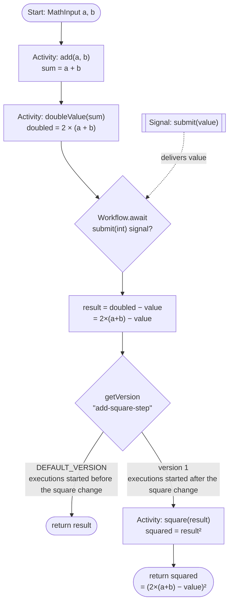

# Temporal Java 기초 (Foundations)

[English](./README.md) · [한국어](./README_ko_kr.md)

Java로 **Temporal**을 배우는 실습형 스타터 랩입니다. **하나의 워크플로**를 네 개의 랩에
걸쳐 한 단계씩 만들어 갑니다 — 첫 액티비티부터 시작해 마지막에는 결정성(determinism)과
버저닝(versioning) 실습으로 마무리합니다.

모든 것이 **디버그 준비 완료** 상태입니다: 브레이크포인트, 디버그 실행 설정, 그리고
브레이크포인트에서 멈춰 있어도 타임아웃이 나지 않도록 넉넉하게 잡아 둔 워크플로 태스크
타임아웃까지 준비되어 있습니다.

---

## 두 개의 모듈: `starter`와 `solution`

| 모듈 | 설명 |
|------|------|
| **`starter/`** | 여러분이 작업할 사본입니다. 뼈대는 갖춰져 있고, `// TODO Lab N` 부분의 본문을 채워 넣습니다. |
| **`solution/`** | 완성되어 바로 실행 가능한 참고 코드입니다. 막힐 때 참고하거나, 실행해서 목표 동작을 확인하세요. |

두 모듈은 같은 패키지(`foundations`)와 같은 파일 이름을 사용하므로, 유일한 차이는
*여러분이 직접 작성하는* 코드뿐입니다.

---

## 무엇을 만드나요

최종적으로 `MathWorkflow`는 다음을 계산합니다:

```
(2 × (a + b) − submittedValue)²
```

예를 들어 `a=3, b=4`이고 시그널로 전달한 값이 `5`라면
`(2×(3+4) − 5)² = (14 − 5)² = 9² = 81`이 됩니다.

랩은 **두 세션**으로 나뉘며 중간에 쉬어 갑니다:

**파트 1 — 파이프라인 구축** (랩 1–3): `2 × (a + b) − submittedValue`까지 완성합니다.

| 랩 | 추가하는 것 | 개념 |
|----|-------------|------|
| **1** | `add(a, b)` 액티비티 + 그것을 호출하는 워크플로 | 첫 액티비티 & 워크플로, 입력 구조체(struct) |
| **2** | 합계에 이어지는 `doubleValue` 액티비티 | 액티비티 체이닝; 각 액티비티는 내구성 있는 체크포인트 |
| **3** | `submit(int)` **시그널**, 그리고 그 값을 빼기 | 시그널 & `Workflow.await` (워크플로 대기시키기) |

**☕ 휴식.**

**파트 2 — 이벤트 히스토리 & 결정성** (랩 4–5): 내구성 있는 로그를 이해한 뒤, 코드를 안전하게 발전시킵니다.

| 랩 | 하는 일 | 개념 |
|----|---------|------|
| **4** | 만든 워크플로의 이벤트 히스토리 읽기 | 이벤트 히스토리: 내구성 있는 로그; 리플레이 |
| **5** | `square` 액티비티를 **안전하게** 도입 | 결정성, 리플레이(replay), `Workflow.getVersion` |

### 완성된 워크플로



> **파트 1**은 `return result`(`2×(a+b) − value`)까지 만듭니다. **파트 2**는 `getVersion`
> 분기와 `square` 액티비티를 추가합니다 — 파트 1에서 시작한 실행을 깨뜨리지 않고 안전하게.

---

## 사전 준비물

1. **JDK 17 이상.** `java -version`으로 확인하세요. macOS에서는
   `brew install openjdk@21`.
2. **실행 중인 Temporal _디버그_ 서버** — [`PREREQUISITES_ko_kr.md`](./PREREQUISITES_ko_kr.md)
   ([English](./PREREQUISITES.md))를 따라 한 번 빌드하고 실행하세요.

> **왜 `temporal server start-dev`가 아니라 디버그 서버인가요?** 랩 5의 결정성 실습(그리고
> 워크플로 코드에서 브레이크포인트를 잡는 것)에는, 멈춰 있는 워커를 서버가 포기하지 않도록
> 내부 타임아웃이 ×100 완화된 서버가 필요합니다. `PREREQUISITES_ko_kr.md`가 바로 그 서버를
> 빌드하며, 아울러 **`tdbg`** — `scripts/history.sh` / `scripts/describe.sh` 헬퍼가
> 데이터베이스의 원시 히스토리를 해독하는 데 쓰는 도구 — 도 제공합니다. 이 설정을 먼저 하세요.

Gradle은 설치할 필요가 없습니다 — 저장소에 *Gradle 래퍼*(`./gradlew`)가 포함되어 있어
최초 실행 시 고정된 버전의 Gradle을 자동으로 내려받습니다. 시스템의 `gradle`이 아니라
항상 `./gradlew`를 사용하세요.

---

## 저장소 구조

```
temporal-java-foundations/
├── README.md / README_ko_kr.md          # 이 가이드 (영문 / 국문)
├── PREREQUISITES.md / PREREQUISITES_ko_kr.md   # 일회성 서버 설정 (영문 / 국문)
├── build.gradle              # 두 모듈이 공유하는 설정
├── settings.gradle           # :starter 와 :solution 포함
├── gradlew / gradle/         # Gradle 래퍼 (설치 불필요)
├── .vscode/launch.json       # VS Code용 디버그 + 실행 설정 (두 모듈)
├── .run/                     # IntelliJ IDEA 실행 설정 (동일한 6개)
├── scripts/                  # bash 헬퍼 (run-worker, start, signal, history, ...)
├── starter/
│   └── src/main/java/foundations/
│       ├── MathInput / DoubleInput / SquareInput .java   # 입력 구조체 (제공됨)
│       ├── MathActivities.java        # @ActivityInterface (제공됨)
│       ├── MathActivitiesImpl.java    # ← 여러분이 본문을 채웁니다
│       ├── MathWorkflow.java          # @WorkflowInterface (제공됨)
│       ├── MathWorkflowImpl.java      # ← 랩을 거치며 여러분이 완성합니다
│       ├── WorkerApp.java             # 코드를 호스팅하고 워커를 시작 (제공됨)
│       ├── Starter.java               # 워크플로 하나를 시작 (제공됨)
│       └── SignalSender.java          # submit(int) 시그널을 전송 (제공됨)
└── solution/                 # 동일한 파일들, 완전히 구현됨
```

---

## 0단계 — 서버가 실행 중인지 확인

[`PREREQUISITES_ko_kr.md`](./PREREQUISITES_ko_kr.md)를 한 번 완료하세요. 그러면 각자
별도의 터미널에서 **Docker 데이터베이스 스택**(`make start-dependencies`)과
**디버그 서버**(`./temporal-server-debug ... start`)가 `localhost:7233`에서 실행되고,
**웹 UI는 http://localhost:8080**에 뜹니다. UI는 켜 두세요 — 이벤트 히스토리, 시그널,
실패를 관찰하는 곳입니다.

---

## 실행 방법

**두 개**의 프로세스가 필요합니다: **워커**(워크플로/액티비티 코드를 실행)와
**스타터**(워크플로 하나를 시작). 랩 3부터는 세 번째 단계로 **시그널** 전송이 추가됩니다.

### 헬퍼 스크립트로 (가장 간단)

`scripts/` 헬퍼는 기본적으로 **`starter`** 모듈을 사용합니다. 참조 모듈을 쓰려면 앞에
`MODULE=solution`을 붙이세요. 전체 목록은 [헬퍼 스크립트](#헬퍼-스크립트)를 참고하세요.

```bash
# 터미널 1 — 워커 (중지하려면 Ctrl-C, 코드 변경 후에는 재시작):
./scripts/run-worker.sh

# 터미널 2 — a=3, b=4로 워크플로 시작:
./scripts/start.sh 3 4

# 터미널 2 — (랩 3 이상) value=5로 submit 시그널 전송:
./scripts/signal.sh 5

# ...그다음 결과 확인:
./scripts/result.sh
```

### Gradle로 직접

`<module>`은 `starter` 또는 `solution`으로 바꿔 넣으세요.

```bash
./gradlew :<module>:run                          # 터미널 1 — 워커
./gradlew :<module>:runStarter --args="3 4"      # 터미널 2 — 시작
./gradlew :<module>:runSignal  --args="5"        # 터미널 2 — 시그널 (랩 3 이상)
temporal workflow result --workflow-id math-wf   # 결과
```

### IDE에서 (브레이크포인트에 가장 좋음)

저장소에는 두 에디터용으로 **동일한 6개의 실행 설정**이 들어 있습니다 — VS Code용
`.vscode/launch.json`, IntelliJ IDEA용 `.run/`. 어느 쪽을 쓰든 흐름은 같습니다:

1. **“Worker (debug) — `<module>`”**를 실행합니다. `TEMPORAL_DEBUG=true`를 설정하여
   *워크플로* 코드의 브레이크포인트가 데드락 감지기(deadlock detector)를 건드리지 않게 합니다.
2. **“Start — `<module>`”**를 실행해 워크플로를 시작합니다.
3. (랩 3 이상) **“Signal — `<module>`”**를 실행해 시그널을 보냅니다.

코드의 `>>> BREAKPOINT <<<` 표시 지점에 브레이크포인트를 찍으세요.

**VS Code.** *Extension Pack for Java*를 설치하고 저장소 폴더를 연 뒤,
**Run and Debug** 패널(Ctrl/Cmd-Shift-D)에서 설정을 고르세요. 실행은 초록색 ▶,
브레이크포인트에서 멈추려면 **Start Debugging**(F5)을 사용합니다.

**IntelliJ IDEA** (Community 또는 Ultimate). 저장소 폴더를 열면 IDEA가 `settings.gradle`을
인식해 Gradle 프로젝트로 임포트합니다. `starter`와 `solution` 모듈이 생기도록 임포트가
끝날 때까지 기다리세요. 그러면 `.run/`의 6개 설정이 툴바의 실행 설정 드롭다운에 나타납니다.
실행은 ▶, 브레이크포인트에서 멈추려면 🐞 **Debug** 버튼을 사용합니다.

> **IDEA 첫 실행 시 참고.** *File → Project Structure → Project*에서 **Project SDK**를
> JDK 17+ 로 지정하세요. 설정에 “module not specified”가 뜨면 Gradle 임포트가 끝나지
> 않았거나(또는 모듈 이름이 다르거나) 그런 것이니, **Gradle** 툴 윈도우에서 🔄로 다시
> 동기화하고 필요하면 설정의 **Module** 드롭다운에서
> `temporal-java-foundations.<module>.main`을 고르세요. `./gradlew` 태스크(`run`,
> `runStarter`, `runSignal`)도 **Gradle** 툴 윈도우에 나열되므로 그쪽을 써도 됩니다.

---

## 파트 1 — 파이프라인 구축 (랩 1–3)

**`starter`** 모듈에서 작업합니다. 각 랩을 마친 뒤에는 **워커를 재시작**하고(워커는
컴파일된 코드를 메모리에 갖고 있습니다) 워크플로를 실행해 결과를 확인하세요. 파트 1은
워크플로가 `2 × (a + b) − submittedValue`를 계산하는 것으로 마무리되며, 그다음 쉬어 갑니다.

### 랩 1 — 첫 액티비티와 워크플로

**목표:** `add(a, b)`가 `a + b`를 반환합니다.

1. `MathActivitiesImpl.java`에서 `add`가 `in.a + in.b`를 반환하도록 구현합니다.
2. `MathWorkflowImpl.java`의 `run(...)`에서 `activities.add(in)`을 호출하고 반환합니다.
3. 워커를 재시작한 뒤:
   ```bash
   ./scripts/start.sh 3 4
   ```
   지금은 `run`이 반환하는 즉시 워크플로가 끝납니다 — 아직 시그널은 필요 없습니다.
   결과가 `7`인지 확인하세요:
   ```bash
   ./scripts/result.sh
   ```

> **왜 구조체인가요?** `MathInput`은 `a`와 `b`를 하나의 JSON 직렬화 가능한 페이로드로
> 담습니다. Temporal은 워크플로/액티비티 인자를 직렬화하므로, public 필드와 인자 없는
> 생성자가 필요합니다.

### 랩 2 — 두 번째 액티비티 체이닝

**목표:** 합계를 두 배로 → `2 × (a + b)`.

1. `MathActivitiesImpl.java`에서 `doubleValue`가 `in.value * 2`를 반환하도록 구현합니다.
2. `run(...)`에서 합계를 `activities.doubleValue(new DoubleInput(sum))`에 넘기고 두 배가 된
   값을 반환합니다.
3. 워커를 재시작하면 `a=3, b=4`는 이제 `14`가 나와야 합니다.

> **내구성 있는 체크포인트.** 각 액티비티 결과는 **이벤트 히스토리**에 기록됩니다. 워커가
> 죽었다 재시작하면, Temporal은 워크플로를 *리플레이(replay)* 하면서 액티비티를 다시
> 실행하는 대신 기록된 결과를 되돌려줍니다. 웹 UI에서 두 개의 `ActivityTaskCompleted`
> 이벤트가 나타나는 것을 확인하세요.

### 랩 3 — 시그널

**목표:** `submit(int)`을 기다린 뒤 `2 × (a + b) − value`를 계산합니다.

1. `MathWorkflowImpl.java`에 시그널 상태(`submitted` 플래그 + `submittedValue`)를 추가하고,
   `submit(int)` 핸들러가 그 값들을 기록하도록 채웁니다.
2. `run(...)`에서 두 배 계산 이후, 시그널이 도착할 때까지 대기했다가 빼기를 수행합니다:
   ```java
   Workflow.await(Duration.ofHours(1), () -> submitted);
   int result = doubled - submittedValue;
   return result;
   ```
3. 워커를 재시작한 뒤:
   ```bash
   ./scripts/start.sh 3 4     # 시작 후 대기(PARK) 상태 (웹 UI에서 Running)
   ./scripts/signal.sh 5      # value=5 전달
   ./scripts/result.sh        # -> 2×(3+4) − 5 = 9
   ```

> **워크플로 대기시키기.** `Workflow.await`는 조건이 참이 될 때까지 워크플로를 —
> 내구성 있게 — 일시 중단시킵니다. 대기 중에는 자원을 전혀 쓰지 않으며, 몇 초든 몇 달이든
> 기다릴 수 있습니다. `await`의 `Duration` 타임아웃은 반드시 유지하세요: 이는 히스토리에
> **`TimerStarted`** 이벤트를 기록하며, 이것이 파트 2(랩 5)에서 중요해집니다.

---

## ☕ 휴식 — 파트 1 종료

두 개의 액티비티를 실행하고, 시그널에서 대기하며, `2 × (a + b) − submittedValue`를 반환하는
내구성 있는 워크플로를 만들었습니다. 쉬어 가기 좋은 지점입니다.

**휴식 전에 워크플로 하나를 대기 상태로 남겨 두세요** — 랩 4에서 살펴봅니다:

```bash
./scripts/reset.sh          # 이전 실행 정리
./scripts/start.sh 3 4      # 시작 후 시그널에서 대기(PARK) — 시그널은 보내지 마세요
```

돌아올 때는 DB 스택과 디버그 서버를 계속 켜 두세요(파트 2는 같은 환경이 필요합니다).

---

## 파트 2 — 이벤트 히스토리 & 결정성 (랩 4–5)

파트 1은 Temporal을 코드를 내구성 있게 "그냥 실행해 주는" 블랙박스로 다뤘습니다. 파트 2는
그 상자를 엽니다: 내구성을 만드는 **이벤트 히스토리**를 읽고(랩 4), 그 이해를 바탕으로 실행이
진행 중인 상태에서 워크플로를 **안전하게** 발전시킵니다(랩 5).

### 랩 4 — 이벤트 히스토리 읽기

**목표:** 파트 1에서 만든 워크플로 뒤에 있는 내구성 있는 로그를 이해합니다. 코드 변경은
없습니다 — 이 랩은 오로지 관찰입니다.

모든 워크플로는 추가 전용(append-only) **이벤트 히스토리**로 뒷받침됩니다. 워커는 자체적인
내구성 상태를 갖지 않으며, 그 히스토리를 **리플레이**하여 모든 것을 재구성합니다. 모든 관찰은
**웹 UI**에서 합니다. 휴식 전에 대기 상태로 남겨 둔 워크플로를 봅시다.

1. **웹 UI**(http://localhost:8080)를 열고 → 네임스페이스 `default` → 워크플로 `math-wf`로
   이동합니다. 상단에 **Running**(여러분의 시그널에서 대기 중)으로 표시됩니다.
2. **History** 패널을 열고 타임라인을 훑으며 각 이벤트를 코드와 대응시켜 보세요:

   | 이벤트 | 어디서 왔나 |
   |--------|-------------|
   | `WorkflowExecutionStarted` | `start.sh` (`MathInput`을 담고 있음) |
   | `ActivityTaskScheduled → Started → Completed` (×2) | `add`, 그다음 `doubleValue` |
   | `TimerStarted` | `Workflow.await(Duration…)` 대기 |
   | *(타이머 이후에는 아직 아무것도 없음)* | 시그널을 기다리는 중 |

   `ActivityTaskScheduled`/`Completed` 이벤트를 클릭해 **Input**과 **Result** 페이로드를
   펼쳐 보세요 — `{a:3, b:4}`가 들어가고 `7`, 그다음 `14`가 돌아오는 것을 볼 수 있습니다.
3. 이제 **시그널을 보내고 히스토리가 자라는 것을 지켜보세요.** 시그널을 보낸 뒤 UI를 새로고침:
   ```bash
   ./scripts/signal.sh 5
   ```
   새 이벤트가 로그에 추가됩니다: `WorkflowExecutionSignaled`(값 `5`), 그리고 워커가 마치면
   `WorkflowExecutionCompleted`(결과 `9`). UI에서 타임라인과 **JSON / Compact** 보기를
   전환하며 원시 이벤트 형태도 확인해 보세요.

> **왜 중요할까요.** 히스토리가 진실의 원천이고, 워커는 언제든 버릴 수 있습니다. 실행 도중
> 워커를 죽여도 새 워커가 히스토리를 리플레이해 동일한 상태를 재구성한 뒤 이어갑니다. 이
> 리플레이는 코드가 매번 **같은 커맨드**를 **같은 순서로** 만들어낼 때만 동작합니다 —
> 이것이 바로 랩 5가 다루는 제약입니다.

<details>
<summary><b>고급 (선택)</b> — 같은 히스토리를 터미널에서 보기 (CLI / <code>tdbg</code>)</summary>

웹 UI가 기본 도구입니다. 아래는 고급 사용자를 위한 터미널 대안입니다.

```bash
temporal workflow show --workflow-id math-wf          # Temporal CLI로 이벤트 히스토리
./scripts/history.sh                                   # tdbg로 해독된 히스토리
./scripts/history.sh math-wf TIMER_STARTED            # await의 타이머만 필터
./scripts/sql.sh q2                                    # 원시 추가 전용 히스토리 원장
```
</details>

### 랩 5 — 결정성과 버저닝

**목표:** 결과를 제곱 → `(2 × (a + b) − value)²`. 단, 이미 실행 중인 워크플로를 **깨뜨리지
않고** 도입합니다.

#### 파트 A — `square`를 안전하게 추가

1. `MathActivitiesImpl.java`에서 `square`가 `in.value * in.value`를 반환하도록 구현합니다.
2. `run(...)`에서 `return result;`를 버전 처리된 제곱 단계로 교체합니다:
   ```java
   int version = Workflow.getVersion("add-square-step", Workflow.DEFAULT_VERSION, 1);
   if (version == Workflow.DEFAULT_VERSION) {
       return result;                                    // 이 변경 이전에 시작된 실행
   }
   return activities.square(new SquareInput(result));    // 새 실행: ^2
   ```
3. 워커를 재시작한 뒤 새로 하나 실행합니다:
   ```bash
   ./scripts/start.sh 3 4 && ./scripts/signal.sh 5 && ./scripts/result.sh   # -> 81
   ```
   **웹 UI**에서 이 새 `math-wf`를 열고, `getVersion`이 히스토리에 기록한
   **`MarkerRecorded`** 이벤트(마커 이름 `Version`)를 찾으세요 — `square` 액티비티 바로
   앞에서 `add-square-step`을 버전 `1`로 기록합니다.

   <details>
   <summary><b>고급 (선택)</b> — 마커를 터미널에서 보기</summary>

   ```bash
   ./scripts/history.sh math-wf MARKER_RECORDED   # changeId "add-square-step", 버전 1
   ```
   </details>

#### 파트 B — 비결정성 오류 목격하기 (권장)

이 실습은 `getVersion`이 *왜* 존재하는지 보여 줍니다. 워크플로 코드는 워커가 재시작될
때마다 **리플레이**되므로 **결정적(deterministic)** 이어야 합니다: 코드가 발행하는 커맨드는
히스토리에 이미 기록된 커맨드와 일치해야 합니다. 실행 중인 워크플로 아래에서 코드를 잘못
바꾸면 리플레이가 실패합니다.

1. 새 워크플로를 시작하되 **시그널을 보내지 마세요** — `await`에서 대기하도록 둡니다:
   ```bash
   ./scripts/reset.sh                # 이전 math-wf 실행 정리
   ./scripts/start.sh 3 4            # 대기(PARK)
   ```
   **웹 UI**에서 `math-wf`가 **Running**이고 히스토리가 `TimerStarted`로 끝나는지 확인하세요.
2. **워커를 중지합니다** (워커 터미널에서 Ctrl-C).
3. *깨뜨리는* 변경을 합니다: `getVersion` 가드 없이 `Workflow.await(...)` **앞에** 액티비티
   호출을 하나 더 추가합니다 — 예:
   ```java
   doubled = activities.doubleValue(new DoubleInput(doubled));  // "잘못된" 삽입
   Workflow.await(Duration.ofHours(1), () -> submitted);
   ```
4. **워커를 재시작**한 뒤 시그널을 보냅니다:
   ```bash
   ./scripts/signal.sh 5
   ```
5. 리플레이가 히스토리에 `TimerStarted`가 기록된 지점에 도달하는데, 새 코드는 대신
   `ScheduleActivityTask(doubleValue)`를 발행합니다 → **비결정성 오류(non-determinism
   error)**. **웹 UI**에서 `math-wf`는 **Running** 상태로 남고, 비결정성을 언급하는
   **`WorkflowTaskFailed`** 이벤트가 보이며 태스크가 계속 재시도됩니다 — 워크플로는 완료되지
   않습니다.

   <details>
   <summary><b>고급 (선택)</b> — 실패를 터미널에서 보기</summary>

   ```bash
   ./scripts/history.sh math-wf TASK_FAILED   # WorkflowTaskFailed 이벤트
   ./scripts/describe.sh                        # 상태: Running, 태스크 재시도 중
   ```
   </details>
6. 잘못된 삽입을 **되돌립니다** (그리고 `./scripts/reset.sh`로 멈춰버린 워크플로를 정리).

**왜 파트 A에서 `square`를 끝에 추가했을 때는 안 깨졌는데, 이건 깨졌을까요?**
리플레이는 코드가 **이미 기록된 커맨드와 어긋나는** 커맨드를 발행할 때만 모순을 감지합니다.
`square`는 마지막으로 기록된 커맨드(타이머) *뒤에서* 실행되므로 새 히스토리를 덧붙이기만
합니다 — 안전합니다. 반면 타이머 *앞에* 추가한 액티비티는 기록된 `TimerStarted`와 충돌합니다
— 안전하지 않습니다. (`await`에 타임아웃을 유지하는 이유이기도 합니다: 타임아웃 없는
`await`는 아무 커맨드도 기록하지 않아 충돌할 대상이 없고, 그러면 오류가 드러나지 않습니다.)

`Workflow.getVersion`은 안전한 덧붙이기가 아닌 모든 변경에 쓰는 범용 도구입니다: 히스토리에
버전 마커를 기록합니다. 변경 **이전에** 시작된 실행에는 마커가 없어 → `getVersion`이
`DEFAULT_VERSION`을 반환 → 옛 분기를 타서 깔끔하게 리플레이됩니다. 변경 **이후에** 시작된
실행은 마커 `1`을 받아 → 새 코드를 실행합니다. 하나의 코드베이스가 둘 다를 처리합니다.
**웹 UI**에서(또는 고급: `./scripts/history.sh <id> MARKER_RECORDED`) 옛 실행과 새 실행의
히스토리를 비교해 보세요.

---

## 헬퍼 스크립트

모든 스크립트는 `scripts/`에 있으며 동일한 기본값(워크플로 ID `math-wf`, 네임스페이스
`default`, 서버 `localhost:7233`)을 읽습니다. 기본적으로 **`starter`** 모듈을 사용하며,
참조 모듈을 대상으로 하려면 `MODULE=solution`을 설정하세요.

**핵심 (워크플로 구동):**

| 스크립트 | 하는 일 |
|----------|---------|
| `run-worker.sh` | 워커 실행(`TEMPORAL_DEBUG=true`). 참조 모듈은 `MODULE=solution ./scripts/run-worker.sh`. |
| `start.sh [a] [b] [id]` | `MathWorkflow` 하나 시작(기본 `a=3 b=4 id=math-wf`). |
| `signal.sh [value] [id]` | `submit(int)` 시그널 전송(기본 `value=5`). |
| `result.sh [id]` | 워크플로 상태 + 결과 출력. |
| `reset.sh [id]` | 워크플로를 종료해 새로 시작할 수 있게 함. |

**고급 / 선택 (터미널에서 관찰 — 기본 도구는 웹 UI).** [`PREREQUISITES_ko_kr.md`](./PREREQUISITES_ko_kr.md)의
`tdbg` 바이너리 / Docker DB가 필요합니다. 체크아웃이 `~/temporal-oss/temporal`에 없다면
`TEMPORAL_SRC=/path/to/temporal`을 설정하세요.

| 스크립트 | 하는 일 |
|----------|---------|
| `history.sh [id] [filter]` | `tdbg`로 원시 이벤트 히스토리 해독; 선택적 grep 필터(예: `MARKER_RECORDED`, `TASK_FAILED`, `TIMER_STARTED`). |
| `describe.sh [id]` | 해독된 뮤터블 상태(`tdbg`) + 상위 상태. |
| `sql.sh [q1\|q2\|q3\|all] [id]` | 원시 MySQL 테이블 조회(상태, 히스토리 원장, 진행 중 타이머). |

---

## 디버깅 팁

- **워크플로 브레이크포인트에는 `TEMPORAL_DEBUG=true`가 필요합니다** (“Worker (debug)” 설정이
  이를 지정합니다). 이것이 없으면 워크플로 코드의 브레이크포인트에서 멈출 때 SDK의 데드락
  감지기가 작동합니다.
- **액티비티 브레이크포인트는 그냥 동작합니다** — 액티비티는 평범한 코드입니다.
- `Starter`는 **15분 워크플로 태스크 타임아웃**을 설정하므로, 워크플로 코드의 브레이크포인트에서
  오랫동안 멈춰 있어도 태스크가 타임아웃되지 않습니다.

---

## 문제 해결

| 증상 | 해결 |
|------|------|
| 시작 시 `Connection refused` / `UNAVAILABLE` | 디버그 서버 / DB 스택이 실행 중이 아닙니다 — [`PREREQUISITES_ko_kr.md`](./PREREQUISITES_ko_kr.md) 참고(`make start-dependencies` + `./temporal-server-debug ... start`). |
| `./gradlew: Permission denied` | `chmod +x gradlew` |
| 고급 스크립트가 `tdbg`를 못 찾음 | `tdbg`는 선택입니다 — `cd $TEMPORAL_SRC && make tdbg` 하거나 `export TEMPORAL_SRC=/path/to/your/temporal`. |
| `UnsupportedOperationException: TODO Lab N` | 해당 단계가 아직 구현되지 않았습니다 — 채워 넣기 전까지 `starter`에서는 정상입니다. |
| `Unsupported class file major version` / Gradle이 시작 안 됨 | `java -version`이 17보다 낮습니다 — JDK 17+ 설치. |
| 의도하지 *않은* 비결정성 오류 | 실행 중인 워크플로가 있는 상태에서 워크플로 코드를 바꿨습니다. 새 워크플로를 시작하거나 `Workflow.getVersion`으로 변경을 가드하세요. |
| 시작 시 `WARNING: sun.misc.Unsafe...` | 무해합니다 — 여러분의 코드가 아니라 최신 JDK에서의 gRPC/Netty 라이브러리 경고입니다. |
| VS Code에 빨간 밑줄이 뜨지만 `./gradlew build`는 성공 | 명령 팔레트 → “Java: Clean Language Server Workspace” 후 리로드. |
| IntelliJ에서 심볼을 못 찾지만 `./gradlew build`는 성공 | **Gradle** 툴 윈도우 → 🔄 *Reload All Gradle Projects*. 그래도 안 되면 *File → Invalidate Caches… → Invalidate and Restart*. |
| IntelliJ 실행 설정에 “module not specified” / “class not found” | Gradle 임포트가 끝나지 않았습니다 — 다시 동기화한 뒤 설정의 **Module** 드롭다운에서 `temporal-java-foundations.<module>.main`을 선택하세요. |
| IntelliJ에서 *워크플로* 코드 브레이크포인트가 워크플로 태스크를 죽임 | `TEMPORAL_DEBUG=true` 없이 일반 “Run” 설정으로 실행했습니다. `.run/`의 **“Worker (debug) — `<module>`”**를 사용하세요. |

---

## 참고

- **태스크 큐:** `foundations-java` · **워크플로 ID:** `math-wf` · **네임스페이스:** `default`
- **웹 UI:** http://localhost:8080
- 전체 빌드: `./gradlew build`
- `SignalSender` / `signal.sh` 대신 CLI로 시그널 보내기:
  ```bash
  temporal workflow signal --workflow-id math-wf --name submit --input 5
  ```
- **고급:** `tdbg`로 원시 히스토리 해독(`history.sh`가 감싸는 명령). tdbg가 엄격하게 요구하는 두 가지:
  `-n`/`--namespace`는 **전역** 플래그라 `execution` 하위 명령 **앞**에 와야 하고, `execution show`는
  DB에서 직접 읽기 때문에 (웹 UI와 달리) **run id**가 필요합니다. `history.sh`가 run id를 대신 찾아 주며,
  원시 형태는 다음과 같습니다:
  ```bash
  RID=$(temporal workflow describe --workflow-id math-wf -o json | sed -n 's/.*"runId": *"\([0-9a-fA-F-]*\)".*/\1/p' | head -1)
  ~/temporal-oss/temporal/tdbg -n default execution show --workflow-id math-wf --run-id "$RID" --decode
  ```
